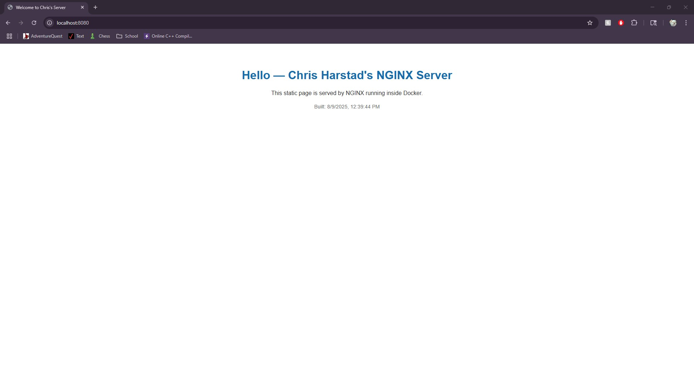

# 🚀 Dockerized NGINX Web Server

This project demonstrates how to build and deploy a lightweight **NGINX web server** inside a Docker container.  
It serves a custom static website from an `html/` directory, making it a great introduction to containerized web applications.

---

## 📸 Screenshot


---

## 🔧 Project Overview
- **Technology Stack:** Docker, NGINX
- **Purpose:** Learn containerization fundamentals and web server deployment
- **Key Features:**
  - Custom Dockerfile based on the official `nginx:stable` image
  - Automatically serves static content from a mounted `html/` folder
  - Easy to run and extend

---

## 📂 Project Structure
```text
nginx-docker-project/
├── Dockerfile        
├── html/             
│   └── index.html    
└── README.md         

---

## ▶️ How to Run

1. **Clone this repository:**
   git clone https://github.com/Hamerharstad/nginx-docker-project.git
   cd nginx-docker-project
Build the Docker image:

docker build -t chris-nginx:1.0 .
Run the container:

docker run -d --name chris-nginx -p 8080:80 chris-nginx:1.0
Access the site:
Open your browser and go to http://localhost:8080


# Dockerized NGINX Web Server

A simple static HTML page served by an NGINX web server running inside a Docker container.


